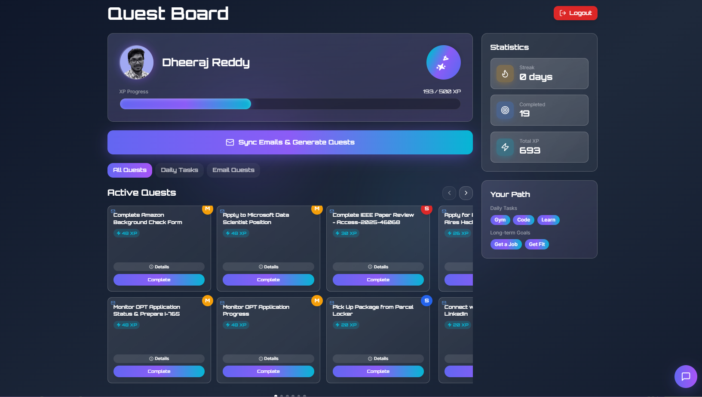
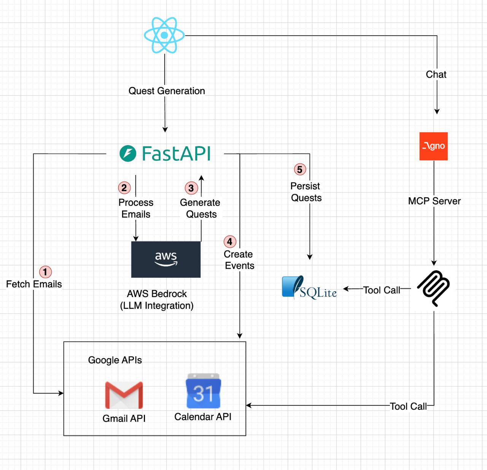
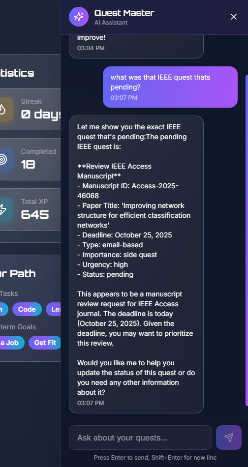
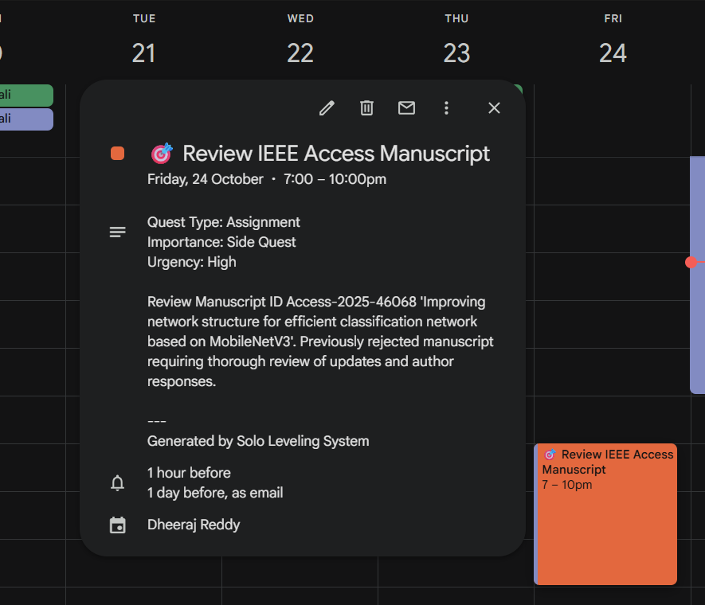

# 🎮 Phoenix: Solo Leveling Your Life

<div align="center">



**Transform Your Inbox Into Epic Quests. Level Up Your Life.**

[](https://choosealicense.com/licenses/mit/)
[](https://www.python.org/)
[](https://reactjs.org/)
[](https://aws.amazon.com/bedrock/)
[](https://fastapi.tiangolo.com/)

</div>

---

## The Problem

**80% of important tasks get lost in your inbox.** Deadlines slip. Opportunities vanish. Students juggle classes, assignments, job applications, and life. All scattered across hundreds of emails. The result? Stress, missed opportunities, and burnout (sometimes even depression).

Traditional todo apps make you **manually extract and organize** everything. What if your inbox could **intelligently transform itself** into an epic RPG quest board?

---

## Our Solution

**Phoenix** is an Multi-Agent productivity system that turns your Gmail and Calendar into a gamified quest management system—inspired by Solo Leveling. Emails and Calendar events become potential quests, every completed task earns XP, and your self-improvement journey transforms into an addictive RPG experience.



1. **📥 Connect Your Gmail** - Secure OAuth integration
2. **🤖 AI Analyzes Emails** - Claude 4.5 Sonnet identifies actionable items
3. **🎯 Creates Quests** - Categorized by importance & urgency, aligned with YOUR goals
4. **⚡ Complete & Earn XP** - Gamified progression system with levels and streaks
5. **💬 Chat with Quest Master** - AI assistant helps you prioritize and strategize
6. **📅 Auto-Syncs to Calendar** - Important deadlines become calendar events

---

## Key Features

### AI-Powered Quest Generation
- **Goal-Aligned Intelligence**: Analyzes emails against your long-term goals
- **Smart Categorization**: Assignment, Interview, Event, Application, Task
- **Dynamic Priority**: Main Quest, Side Quest, Daily, Weekly
- **Urgency Detection**: Critical, High, Medium, Low

### Immersive RPG Experience
- **Level Up System**: Earn XP, climb levels, track progress
- **Quest Ranks**: D, C, B, A, S rank quests based on difficulty
- **Streak Tracking**: Build daily completion streaks
- **XP Multipliers**: Higher urgency = more XP rewards

### AI Quest Master Assistant
- **Natural Chat Interface**: Ask about quests, priorities, and stats
- **Context-Aware**: Understands your quest history and goals
- **Motivational**: Encouraging, RPG-themed responses
- **Powered by Agno**: Advanced agent framework with tool-calling

### Seamless Integrations
- **Gmail**: OAuth 2.0 secure access
- **Google Calendar**: Auto-create events for deadlines
- **AWS Bedrock**: Claude 4.5 Sonnet for quest analysis
- **SQLite**: Lightweight, local-first data storage

### Progress Analytics
- **Level Dashboard**: Current level, XP, completion rate
- **Quest Stats**: Track by type, importance, and status
- **Streak Monitoring**: Visualize consistency
- **Historical Data**: See your growth over time

---

## Architecture

### **Tech Stack**

#### **Backend** (Python FastAPI)
```
├── FastAPI Server         # RESTful API
├── AWS Bedrock           # Claude 4.5 Sonnet LLM
├── Agno Framework        # AI Agent with Tools
├── SQLite                # Local database
├── Gmail API             # Email fetching
└── Google Calendar API   # Event creation
```

#### **Frontend** (React + TypeScript)
```
├── React 18              # UI Framework
├── Vite                  # Build tool
├── Tailwind CSS          # Styling
├── shadcn/ui             # Component library
├── Framer Motion         # Animations
└── Zustand               # State management
```

### **System Flow**

```python
# 1. Email Processing Pipeline
Gmail → OAuth → Fetch Emails → Store in DB
  ↓
AI Analysis (AWS Bedrock)
  ↓
Goal Alignment Check
  ↓
Quest Creation → Calendar Event
  ↓
User Dashboard Update
```

```typescript
// 2. Frontend Quest Management
User Login (Google OAuth)
  ↓
Onboarding (Set Goals)
  ↓
Sync Emails Button → API Call
  ↓
Display Quests (Filter by type)
  ↓
Complete Quest → Earn XP → Level Up
  ↓
Chat with AI Assistant
```

---

## Use Cases

### For Students
- **Assignment Tracking**: Never miss a deadline again
- **Job Applications**: Track interview invitations and follow-ups
- **Event Management**: Convert tech talks, workshops into quests
- **Goal Alignment**: Prioritize emails that advance your career goals

### For Professionals
- **Project Deadlines**: Auto-extract meeting invites and action items
- **Client Follow-ups**: Track important communication
- **Career Development**: Prioritize learning opportunities
- **Work-Life Balance**: Gamify personal goals alongside work

### For Entrepreneurs
- **Deal Pipeline**: Track investor meetings and pitches
- **Customer Outreach**: Never drop a follow-up
- **Product Launches**: Organize launch tasks from scattered emails
- **Network Building**: Track coffee chats and networking events

---

## Screenshots

<div align="center">

### Quest Dashboard


*Immersive RPG-style interface with quest cards, XP bars, and level indicators*

### AI Quest Master Chat


*Natural language chat with context-aware AI assistant*

### Calendar Integration


*Automatic calendar event creation for important deadlines*

</div>

---

## Quick Start

### Prerequisites
```bash
- Python 3.11+
- Node.js 18+
- AWS Account (Bedrock access)
- Google Cloud Project (Gmail & Calendar APIs)
```

### 1. Clone & Install

```bash
# Clone repository
git clone https://github.com/Phoenix-Solo-Leveling/Phoenix.git
cd Phoenix

# Install backend dependencies
pip install -r requirements.txt

# Install frontend dependencies
cd frontend
npm install
cd ..
```

### 2. Configure Environment

Create `.env` file:
```bash
# AWS Configuration
AWS_REGION=us-east-1
AWS_ACCESS_KEY_ID=your_access_key
AWS_SECRET_ACCESS_KEY=your_secret_key
AWS_SESSION_TOKEN=your_session_token  # Optional for temporary credentials

# Bedrock Model
BEDROCK_MODEL_ID=<YOUR_BEDROCK_MODEL_ID>

# Database
DB_PATH=./solo_leveling.db (Can be changed to production database path)

# Processing
DEFAULT_DAYS_TO_PROCESS=7
DEFAULT_EVENT_DURATION_MINUTES=60
```

### 3. Setup Google OAuth

1. Go to [Google Cloud Console](https://console.cloud.google.com/)
2. Create a new project
3. Enable Gmail API and Google Calendar API
4. Create OAuth 2.0 credentials (Desktop app)
5. Download `client_secret.json` to `credentials/` folder
6. Add authorized redirect URI: `http://localhost:3000`

### 4. Run the Application

#### Terminal 1: Backend
```bash
cd src/api
python main.py
```
Server runs on `http://localhost:8000`

#### Terminal 2: Frontend
```bash
cd frontend
npm run dev
```
Frontend runs on `http://localhost:8080`

### 5. First Time Setup

1. Visit `http://localhost:8080`
2. **Sign in with Google** (authorizes Gmail & Calendar access)
3. **Complete Onboarding**:
   - Select focus areas (Study, Fitness, Productivity)
   - Set difficulty level (Casual, Balanced, Hardcore)
   - Define daily tasks
   - Set long-term goals
4. **Sync Emails**: Click "Sync Emails & Generate Quests"
5. **Start Questing!** Complete tasks, earn XP, level up

---

## API Documentation

### **Core Endpoints**

#### Authentication & Onboarding
```http
POST /onboarding
```
Setup user preferences and create initial daily quests

#### Quest Management
```http
GET  /users/{user_id}/quests?quest_type=email_based
POST /users/{user_id}/quests/{quest_id}/complete
GET  /users/{user_id}/stats
```

#### Email Processing
```http
POST /users/{user_id}/process-emails?days=7
```
Fetch Gmail, analyze with AI, create quests

#### AI Assistant
```http
POST /chat
```
Chat with Quest Master AI agent

**[Full API Documentation →](./openapi.yaml)**

---

## Key Technical Innovations

### 1. **Goal-Aligned AI**
Unlike generic todo apps, Phoenix analyzes emails against **your specific long-term goals**:
```python
def generate_quest_analysis_with_goals(email_data, user_preferences):
    goals = user_preferences.get('long_term_goals', [])
    prompt = f"""
    User Goals: {goals}
    
    Analyze if this email aligns with these goals:
    - Does it advance their career?
    - Is it urgent and important?
    - What's the action item?
    """
    return bedrock_client.invoke_model(prompt)
```

### 2. **Intelligent Quest Categorization**
Multi-dimensional classification:
- **Type**: Assignment, Event, Interview, Application
- **Importance**: Main Quest, Side Quest, Daily, Weekly
- **Urgency**: Critical, High, Medium, Low
- **Category**: Work, Education, Health, Personal

### 3. **Dynamic XP System**
```python
xp_reward = base_xp[importance] * urgency_multiplier[urgency]
# Main Quest + Critical = 200 * 3 = 600 XP
# Daily Task + Low = 25 * 1 = 25 XP
```

### 4. **Level Progression**
```python
Level 0 → 1: 100 XP
Level 1 → 2: 200 XP
Level 2 → 3: 300 XP
Level N → N+1: (N+1) * 100 XP
```
Increasing difficulty keeps users engaged long-term

### 5. **Agno AI Agent with Tools**
```python
@tool()
def get_quests_by_importance(importance: str) -> str:
    """AI can intelligently query database"""
    return db_manager.get_quests(importance=importance)
```
Agent has 6+ tools for quest management, stats, and updates

---

## 🔮 Future Roadmap

- [ ] Multi-platform support (Slack, Discord, Teams)
- [ ] Smart scheduling & habit tracking
- [ ] Team quests & collaboration
- [ ] Gamification: skill trees, achievements, leaderboards
- [ ] Mobile apps & popular integrations
- [ ] Social features: communities, quest templates, global events


---

## 🧪 Testing

```bash
# Test Bedrock Connection
python tests/test_bedrock_client.py

# Test Database
python tests/test_db_inspect.py

# Test Level Calculation
python tests/test_level_calculation.py

# Run Email Processing
python scripts/process_emails.py --days 7

# Reset Database (WARNING: Deletes all data)
python scripts/reset_database.py
```

---

## 🤝 Contributing

We welcome contributions! Here's how:

1. **Fork the repository**
2. **Create a feature branch**: `git checkout -b feature/amazing-feature`
3. **Commit your changes**: `git commit -m 'Add amazing feature'`
4. **Push to the branch**: `git push origin feature/amazing-feature`
5. **Open a Pull Request**

### Development Setup
```bash
# Create virtual environment
python -m venv venv
source venv/bin/activate  # On Windows: venv\Scripts\activate

# Install dev dependencies
pip install -r requirements.txt
pip install pytest black flake8

# Run tests
pytest tests/

# Format code
black src/ scripts/ tests/
```

---

## 📄 License

This project is licensed under the MIT License - see the [LICENSE](LICENSE) file for details.

---

## Devs 

- **[Dheeraj Mudireddy](https://github.com/reddheeraj)**
- **[Praneet Surabhi](https://github.com/psylence0609)**
- **[Sai Patibandla](https://github.com/spda)**
- **[Akash Pillai](https://github.com/akash-pillai-n)**

## 🙏 Acknowledgments

- **Anthropic Claude 4.5 Sonnet** - Powers our AI quest analysis
- **Agno Framework** - AI agent orchestration
- **shadcn/ui** - Beautiful React components
- **Solo Leveling** - Inspiration for the gamification system

**[⭐ Star us on GitHub](https://github.com/Phoenix-Solo-Leveling/Phoenix)** if Phoenix helps you level up!

*"The only way to do great work is to love what you do... and turn it into a game." - Steve Jobs (probably)*

</div>
